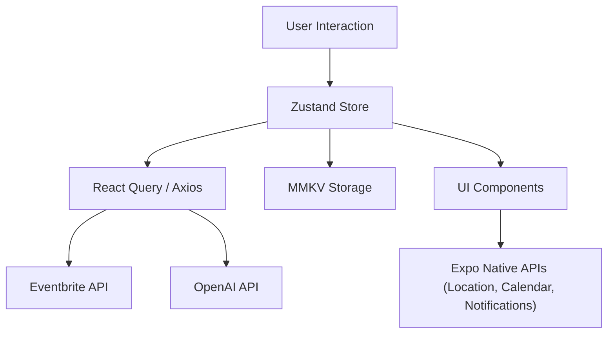

# ⚛️ EventPulse — Local Events + AI Insights (Expo + Zustand + MMKV Edition)

## 🎯 Summary

EventPulse is a real-time local event discovery app that surfaces upcoming concerts, festivals, meetups, and shows based on the user’s live location.

It integrates real event APIs (Ticketmaster or Eventbrite), AI-generated summaries, and offline favorites — all wrapped in a smooth Expo + React Native experience.

##### Goal: When a user downloads the app, they instantly see real nearby events, view AI summaries, and experience my engineering quality firsthand — without logging in or setting up anything.

## 🧩 Core Tech Stack

| Category                       | Library / Tool                             | Why It’s Chosen                                    |
| ------------------------------ | ------------------------------------------ | -------------------------------------------------- |
| Framework                      | Expo SDK 54+                               | Simplifies deployment, native modules, OTA updates |
| State                          | Zustand                                    | Lightweight, modern, and clean state management    |
| Storage                        | react-native-mmkv (Expo-compatible build)  | Ultra-fast offline storage for favorites and cache |
| Networking                     | react-query or axios                       | Efficient async caching + retry logic              |
| Maps                           | react-native-maps (via Expo config plugin) | Native maps integration for location + events      |
| AI Integration                 | OpenAI API                                 | Real AI summaries and recommendations              |
| Animations                     | react-native-reanimated + moti             | High-performance, Expo-ready animations            |
| Styling                        | nativewind                                 | Tailwind-based utility styling for rapid UI        |
| Notifications                  | expo-notifications                         | Local reminders for saved events                   |
| Calendar                       | expo-calendar                              | Native calendar integration                        |
| Permissions                    | expo-location, expo-permissions            | Handles GPS + calendar access                      |
| Charts                         | victory-native or react-native-svg-charts  | Data visualization for insights                    |
| Testing Jest + Testing Library | Lightweight                                | test coverage for key flows                        |

## 🏗️ Architecture (Expo-Optimized)

```
/src
 ├── api/              # external APIs (Eventbrite, Ticketmaster, OpenAI)
 ├── components/       # reusable UI components (cards, modals, buttons)
 ├── features/
 │    ├── map/         # map view + location-based event fetching
 │    ├── events/      # event list + details
 │    ├── ai/          # AI summaries and suggestions
 │    ├── favorites/   # offline saved events
 │    └── showcase/    # "About this app" for recruiters
 ├── hooks/            # useLocation, useAIInsights, useEvents, etc.
 ├── store/            # Zustand stores
 ├── utils/            # helpers (formatters, error handlers)
 ├── navigation/       # tab + stack navigation
 └── assets/           # icons, images, fonts
```

Architecture Pattern:🧱 Feature-based modular + Clean layering→ Scalable, testable, and demonstrates modern engineering discipline.

📱 Screen-by-Screen Breakdown

## 1️⃣ Splash / Intro Screen

Purpose: Establish visual polish and smooth entry.

### UI Concept:

- Animated logo (using Moti + Reanimated)
- Fades into Home/Map screen after 1.5s

### Skills Demonstrated:

- Expo splash & font loading
- Animation sequencing (Reanimated)
- Clean transitions

## 2️⃣ Home / Map Screen

Purpose: Instant “wow” with live data and motion.

### UI Concept:

- Interactive map using react-native-maps
- Pins for real events near the user’s location
- Bottom sheet showing nearby events list (Reanimated + Gesture Handler)
- Category filter (music, sports, festivals, etc.)

### Skills Demonstrated:

- Native module config via Expo plugin
- Real API data fetching (Eventbrite/Ticketmaster)
- Location permissions via expo-location
- Reactive state with Zustand
- Declarative UI motion

## 3️⃣ Event Details Screen

Purpose: Show real API integration + AI augmentation.

### UI Concept:

- Event banner image, title, venue, time
- AI-generated summary using OpenAI (based on description + tags)
- Buttons: “Add to Calendar,” “Remind Me,” “Open in Maps,” “Save”

### Skills Demonstrated:

- OpenAI integration (custom prompts)
- Native calendar & map linking via Expo APIs
- Local persistence with MMKV
- Error + loading management with React Query
- Data transformation logic

## 4️⃣ Favorites / Offline Screen

Purpose: Demonstrate persistence, caching, and background jobs.

### UI Concept:

- List of saved events (stored in MMKV)
- Offline availability
- Option to set reminders via expo-notifications

### Skills Demonstrated:

- MMKV-based data storage
- Persistent Zustand store with middleware
- Notifications via Expo
- Offline UX with fallback UI states

## 5️⃣ AI Insights Screen

Purpose: Show off intelligent personalization and real-time data processing.

### UI Concept:

- “AI Suggestions” like:“You seem to like live music — here are top 3 shows this week.”
- Pulls context from favorited events + current city
- Uses OpenAI or HuggingFace for text generation
- Animated list reveal (Moti)

### Skills Demonstrated:

- Prompt design and AI integration
- Context-based content generation
- Async request orchestration
- Advanced animations
- Combining user data + external data meaningfully

## 6️⃣ Showcase / About Screen

Purpose: A meta tab for employers.

### UI Concept:

- Animated logos for Expo, Zustand, MMKV, Reanimated
- Architecture diagram rendered via SVG
- Buttons: “View Source,” “LinkedIn,” “Portfolio”
- AI-generated summary describing the app

### Skills Demonstrated:

- Self-documenting engineering
- SVG rendering
- Multi-platform linking (mailto, external)
- Modern branding polish

## 🧠 Skill Demonstration Summary

| Skill Area                | Feature Demonstrated                                                         |
| ------------------------- | ---------------------------------------------------------------------------- |
| Expo Expertise            | OTA updates, managed workflow, Expo APIs (Location, Calendar, Notifications) |
| State Management          | Centralized global store with Zustand + persistence middleware               |
| Performance Optimization  | MMKV for fast, synchronous reads/writes                                      |
| AI Integration            | OpenAI text generation for event insights                                    |
| Real API Workflows        | Eventbrite/Ticketmaster live data with error handling                        |
| Offline-First Design      | MMKV cache + background event sync                                           |
| Animation Polish          | Reanimated & Moti for transitions                                            |
| Native Integrations       | Calendar, Notifications, Deep Linking                                        |
| Data Visualization        | Event analytics charts via victory-native                                    |
| Professional Storytelling | Showcase tab + clean architecture                                            |

🧱 Expo-Friendly Data Flow



This structure shows scalable separation of concerns, and interviewers will immediately recognize it as a production-grade architecture.

## 🗓️ 3-Month Sprint Plan (Expo Timeline)

| Phase                           | Duration    | Deliverables                                                                      | Key Focus |
| ------------------------------- | ----------- | --------------------------------------------------------------------------------- | --------- |
| Phase 1: Core Infrastructure    | Weeks 1–3   | Expo setup, Zustand store, Maps + Location Foundation, modular setup              |
| Phase 2: Events API Integration | Weeks 4–6   | Fetch + cache real events, Event Details screen Networking, API integration       |
| Phase 3: AI + Offline Mode      | Weeks 7–9   | AI summaries, Favorites, MMKV persistence AI, data persistence                    |
| Phase 4: UX & Polish            | Weeks 10–12 | Animations, Showcase tab, notifications, store build Visual polish, deployability |

## 🎨 UI Style Guide

- Theme: Dark + glassmorphic
- Primary Colors: #1E293B (slate) + accent gradient per category
- Font: Inter (Expo Google Fonts)
- Layout: Bottom tabs → Map / AI / Favorites / Showcase
- Animations: Smooth fade/slide transitions via Moti/Reanimated
- Interaction: Scrollable bottom sheet with spring animation

<!-- ## 🧠 Interview Storyline

When you present this app to potential employers:
1. “I built EventPulse with Expo to deliver fast iteration, native integration, and OTA updates.”
2. “All data is live — pulled from real event APIs and summarized using AI.”
3. “I used Zustand + MMKV for high-speed persistence and state isolation.”
4. “The app demonstrates AI integration, offline support, and full native interoperability.”
5. “You can try it instantly — no login, just open and experience real data.” -->

## 🧩 Deliverables for Portfolio

- 📱 App on Play Store + App Store (Expo EAS build)
- 💻 Public GitHub repo with modular architecture and clean commits
- 🎥 30-second demo reel (show map, AI insights, smooth transitions)
- 🧾 README with architecture diagram and short tech write-up

# Developer Specific

## Commands

### Android

- adb devices
- ./gradlew clean
- ./gradle --stop
- ps -A | grep gradle find all running dameons
- sudo kill -9 <process ID> (Kill the process with this command)

### Local Android Builds

- Android APK no eas preview environment
- 1. APP_ENV=preview npx expo prebuild --clean
- 2. APP_ENV=preview npx expo run:android --variant release

- Dev environment defaults to debug apk
- 1. npx expo prebuild --clean
- 2. npx expo run:android

### EAS

- npx eas build -p ios --clear-cache
- npx eas build -p android --clear-cache

### Metro for Local

- npx expo start --clear

### Jest Testing
- npm test
- npm test -- --watch
- npx jest --clearCache


### Quick Clear Cache
<!-- TODO MAKE THIS A CLEAR CACHE SCRIPT -->

[expo cli clear cache](https://docs.expo.dev/troubleshooting/clear-cache-windows/#expo-cli-and-npm)

- rm -rf node_modules
- npm cache clean --force
- npm install
- watchman watch-del-all
  <!-- - rm -fr $TMPDIR/haste-map-* -->
  <!-- - rm -rf $TMPDIR/metro-cache -->
- del %localappdata%Temphaste-map-\*
- del %localappdata%Tempmetro-cache
- npx expo start --clear

## Troubleshooting

1. ```
      A problem occurred evaluating settings 'android'.
      > A problem occurred starting process 'command 'node''
   ```

2. Installation error: INSTALL_PARSE_FAILED_NO_CERTIFICATES
   posiibly due to running builds (no eas) on simulator then on usb device. The type of usb cable was also an issue for others in link below
   https://stackoverflow.com/questions/2914105/what-is-install-parse-failed-no-certificates-error
   - rm -rf node_modules
   - rm package-lock.json
   - rm -rf $TMPDIR/haste-map-\*
   - rm -rf $TMPDIR/metro-cache
   - watchman watch-del-all
   - npm cache clean -f
   - Make sure Android studio is closed
   - uninstall any trace from phone
   - npm i
   - npx expo install --check
   - npx expo-doctor
   - npx expo run:android
3. Peer deps check
   - npm ls react react-test-renderer (had to downgrade this to react 19.1, it wanted react 19.2)


<!-- # Welcome to your Expo app 👋

This is an [Expo](https://expo.dev) project created with [`create-expo-app`](https://www.npmjs.com/package/create-expo-app).

## Get started

1. Install dependencies

   ```bash
   npm install
   ```

2. Start the app

   ```bash
   npx expo start
   ```

In the output, you'll find options to open the app in a

- [development build](https://docs.expo.dev/develop/development-builds/introduction/)
- [Android emulator](https://docs.expo.dev/workflow/android-studio-emulator/)
- [iOS simulator](https://docs.expo.dev/workflow/ios-simulator/)
- [Expo Go](https://expo.dev/go), a limited sandbox for trying out app development with Expo

You can start developing by editing the files inside the **app** directory. This project uses [file-based routing](https://docs.expo.dev/router/introduction).

## Get a fresh project

When you're ready, run:

```bash
npm run reset-project
```

This command will move the starter code to the **app-example** directory and create a blank **app** directory where you can start developing.

## Learn more

To learn more about developing your project with Expo, look at the following resources:

- [Expo documentation](https://docs.expo.dev/): Learn fundamentals, or go into advanced topics with our [guides](https://docs.expo.dev/guides).
- [Learn Expo tutorial](https://docs.expo.dev/tutorial/introduction/): Follow a step-by-step tutorial where you'll create a project that runs on Android, iOS, and the web.

## Join the community

Join our community of developers creating universal apps.

- [Expo on GitHub](https://github.com/expo/expo): View our open source platform and contribute.
- [Discord community](https://chat.expo.dev): Chat with Expo users and ask questions. -->
