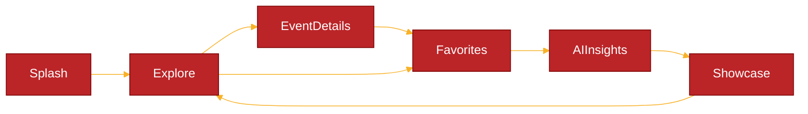
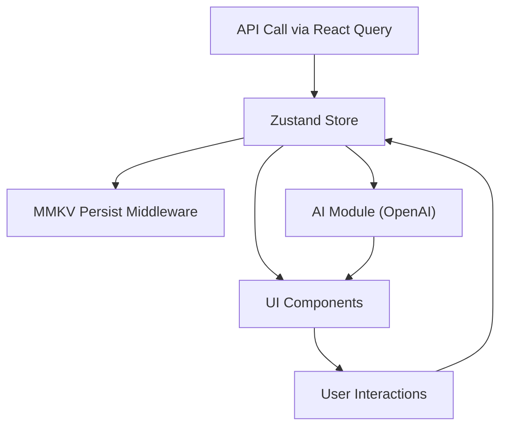

# ⚛️ EVENTPULSE — UI STORYBOARD & NAVIGATION FLOW

## 🧭 App Overview

- Goal: Let users instantly discover real local events (music, sports, festivals, etc.) with live data and AI-powered summaries — no login, no friction.
- Navigation Type: Bottom Tab Navigator + Stack for details.
- Main Tabs:
  1. 🗺️ Explore (Map)
  2. 🤖 AI Insights
  3. ⭐ Favorites
  4. 💡 Showcase

## 🗺️ Screen 1 — Splash / Intro

✨ Purpose:

Polished first impression + branding.Auto-transitions to Explore screen.

🧱 Layout (Wireframe Text):

```csharp
[Centered Logo: EventPulse pin animation]
[Subtitle: "Discover live events around you"]
[Animated gradient background (Moti)]
[Faint pulsing ripple under logo]
```

### 🎨 Interactions:

- Auto-fades out after 1.5s → navigates to “Explore”.
- Background gradient shifts color (warm to cool tone).

### ⚙️ Tech Stack:

- Expo + Moti + Reanimated
- Custom font via expo-font
- Auto navigation via useEffect

### 💪 Skills Shown:

- App bootstrapping & animation flow.
- Reanimated + Moti usage.
- Expo splash configuration.

## 🧭 Screen 2 — Explore (Map)

✨ Purpose:

The hero screen — shows live events on a map.This is the “wow” moment for recruiters.

🧱 Layout (Wireframe Text):

```pgsql
[Top Search Bar]  (for keywords or cities)
-------------------------------------------------
|                                                |
|   [MapView - react-native-maps]                |
|     🟣 Pins = Event locations                  |
|     📍 User location marker                    |
|                                                |
-------------------------------------------------
[Bottom Sheet (draggable up)]
  ├── [Horizontal Filter Chips: Music | Sports | Comedy | Tech]
  ├── [List of Nearby Events]
  │     ├── [Thumbnail] [Title] [Date]
  │     └── [Distance | Category tag]
```

### 🎨 Interactions:

- Tap a pin → opens event preview in bottom sheet.
- Drag bottom sheet up → reveals list view.
- Tap event → navigates to Details screen.

### ⚙️ Tech Stack:

- react-native-maps
- expo-location for geolocation
- react-native-gesture-handler + reanimated-bottom-sheet
- react-query for data fetching
- zustand for global state
- mmkv for caching API results

### 💪 Skills Shown:

- Native API permissions via Expo.
- Realtime location tracking.
- Asynchronous API handling with error states.
- Reanimated gestures and dynamic UI.
- Modular feature folder structure.

## 🎫 Screen 3 — Event Details

✨ Purpose:

Demonstrate AI + Native API integration with real data.

🧱 Layout (Wireframe Text):

```csharp
[Hero Image Banner]
[Event Title]
[Date | Time | Venue]
[Divider]
[AI Summary Section 🧠]
   "AI Summary: This concert blends synthwave with indie rock vibes..."
[Divider]
[Buttons Row]
   [⭐ Save]   [📅 Add to Calendar]   [📍 Open in Maps]   [🔔 Reminder]
[Section: More Info]
   [Ticket link] [Description] [Category Tags]
```

### 🎨 Interactions:

- Tap “Save” → event stored in MMKV + Zustand.
- Tap “Add to Calendar” → uses expo-calendar.
- Tap “Open in Maps” → deep link to Google/Apple Maps.
- “Reminder” → schedules Expo local notification.

### ⚙️ Tech Stack:

- react-query for API fetch
- OpenAI API for summary generation
- expo-calendar
- expo-notifications
- mmkv + Zustand persistence middleware

### 💪 Skills Shown:

- AI prompt engineering & OpenAI integration.
- Expo native modules integration.
- Cross-platform linking & native permissions.
- Smooth async flow handling.

## ⭐ Screen 4 — Favorites (Offline)

✨ Purpose:

Show offline-first architecture & fast storage with MMKV.

🧱 Layout (Wireframe Text):

```pgsql
[Header: "Saved Events"]
-------------------------------------------------
| [List of saved events]                        |
|   ├── [Thumbnail] [Title] [Date] [Location]   |
|   └── Swipe left to remove                    |
-------------------------------------------------
[Empty State] "No saved events yet."
[Button: "Explore nearby events →"]
```

### 🎨 Interactions:

- Tap saved item → open Event Details (offline mode).
- Swipe to remove → instantly updates local store.
- Automatically rehydrates from MMKV on launch.

### ⚙️ Tech Stack:

- Zustand store persisted with zustand/persist
- MMKV as persistence engine
- FlatList rendering
- Expo notifications for reminders

### 💪 Skills Shown:

- Offline caching and rehydration.
- Local data management with MMKV.
- Performance-optimized rendering.
- Background data integrity.

## 🤖 Screen 5 — AI Insights

✨ Purpose:

Demonstrate AI personalization and data-driven UX.

🧱 Layout (Wireframe Text):

```csharp
   [Header: "AI Event Insights"]
-------------------------------------------------
🧠 [Card: Personalized Summary]
   "You’ve favorited 3 music events. Here are upcoming shows you might like."
-------------------------------------------------
🎤 [AI Recommendations Carousel]
   [Event 1 Card] [Event 2 Card] [Event 3 Card]
-------------------------------------------------
📊 [Mini Trend Graph]
   "Most popular event category in your area: Music"
-------------------------------------------------
```

### 🎨 Interactions:

- Pull-to-refresh → triggers new AI suggestions.
- Tap recommended event → navigates to Details.
- Typing animation for AI summary.

### ⚙️ Tech Stack:

- OpenAI API for contextual text
- Zustand for user context (past favorites, categories)
- Victory Native for small graphs
- Moti for typing effect animation

### 💪 Skills Shown:

- AI prompt design & contextualization.
- Data aggregation + visualization.
- Smooth async UX with transitions.
- Integration between AI + local app state.

## 💡 Screen 6 — Showcase / About

✨ Purpose:

A transparent “tech story” for employers.

🧱 Layout (Wireframe Text):

```csharp
[Header: "About EventPulse"]
-------------------------------------------------
[Animated Icons Row: Expo | Zustand | MMKV | OpenAI | Reanimated]
-------------------------------------------------
[Architecture Diagram SVG]
-------------------------------------------------
"Built with ❤️ by [Your Name]"
[Button: "View Source on GitHub"]
[Button: "Connect on LinkedIn"]
[AI-generated tagline: “Intelligent events, simplified.”]
```

### 🎨 Interactions:

- Tap GitHub → open repo link.
- Tap LinkedIn → opens profile in in-app browser.

### ⚙️ Tech Stack:

- Expo Linking
- SVG rendering via react-native-svg
- Animated icon transitions with Moti

### 💪 Skills Shown:

- Developer storytelling.
- SVG animations and linking.
- Branding and presentation polish.

## 🧭 Navigation Flow Diagram



## 🧩 Explanation:

- Bottom Tabs: Explore | AI Insights | Favorites | Showcase
- Stack Navigation: Explore → Event Details
- Seamless transitions (slide/fade) using Reanimated.

## ⚙️ Data Flow (Zustand + MMKV)



This pattern ensures:

- Single source of truth (Zustand)
- Fast persistence (MMKV)
- Local-first architecture
- AI reacts to state updates dynamically

## 🧩 Technical Skill Matrix by Screen

| Screen        | Real API | AI  | Offline | Native | Animation | Storage | Architecture |
| ------------- | -------- | --- | ------- | ------ | --------- | ------- | ------------ |
| Splash        | —        | —   | —       | —      | ✅        | —       | ✅           |
| Explore       | ✅       | —   | ✅      | ✅     | ✅        | ✅      | ✅           |
| Event Details | ✅       | ✅  | ✅      | ✅     | —         | ✅      | ✅           |
| Favorites     | ✅       | —   | ✅      | ✅     | —         | ✅      | ✅           |
| AI Insights   | ✅       | ✅  | ✅      | —      | ✅        | ✅      | ✅           |
| Showcase      | —        | ✅  | —       | —      | ✅        | —       | ✅           |

## 🗓️ Development Timeline (3 Months)

| Phase                   | Duration                 | Deliverables                                                                                |
| ----------------------- | ------------------------ | ------------------------------------------------------------------------------------------- |
| 1️⃣ Foundations          | Weeks 1–3 Start (10/23)  | Expo setup, Zustand + MMKV integration, Prettier, Theme Light & Dark Mode, Splash, Map view |
| 2️⃣ Data Integration     | Weeks 4–6 Start (11/13)  | Event APIs + caching + navigation                                                           |
| 3️⃣ AI + Native Features | Weeks 7–9 Start (12/25)  | OpenAI integration, Calendar, Notifications                                                 |
| 4️⃣ Polish & Launch      | Weeks 10–12 Start (1/15) | Animations, Haptics, Showcase screen, store deployment                                      |

## 🧠 Recap — Why This App Impresses

✅ Expo-managed build (easier to deploy + OTA updates)

✅ Zustand + MMKV architecture (lightning-fast and modern)

✅ AI integration (context-aware recommendations)

✅ Offline-first design (real data, cached locally)

✅ Polished UX (Moti/Reanimated animations)

✅ Native integrations (Maps, Calendar, Notifications)

✅ Production architecture (feature-based modular)

✅ No login — instant recruiter demo value

Notes Polish Features:

- Animation logo pulsing from splash to home -- loading
- Bottom tabs hide on scroll down, like linkedIn
- Bottom tabs haptics
- Typography
- Test Accessibility
- Check Map Config -- Will need to configure thie for android https://docs.expo.dev/versions/latest/sdk/maps/
- Add advanced controls to map view
- Hide API KEYS on separate custom server
- Outside of the app I Build out light weight express server to handle backend calls via proxy to keeps safe, with rate limiting and caching

Notes on add ons

- Added unit testing for common components and hooks
